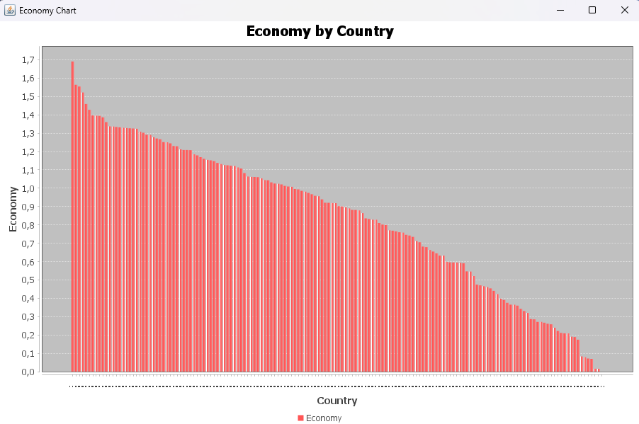

###  csv
Пакет отвечает за чтение и обработку CSV-файла.

- **CsvParser**
    - Считывает CSV-файл с данными по странам
    - Парсит строки файла
    - Создаёт объекты модели `CountryRecord`

---

### model
Пакет содержит объектную модель данных.

- **CountryRecord**
    - Представляет одну запись из CSV-файла
    - Содержит данные о стране, регионе и числовых показателях

---

### db
Пакет отвечает за работу с базой данных SQLite.

- **Database**
    - Устанавливает соединение с базой данных SQLite

- **SchemaInitializer**
    - Загружает SQL-скрипт создания таблиц
    - Инициализирует структуру базы данных при запуске приложения

- **CountryDao**
    - Отвечает за сохранение и извлечение объектов `CountryRecord` из бд
- **QueryExecutor**
    - Содержит SQL запросы
    - Выполняет запросы
    - Выводит результаты запросов в консоль

---

### chart
Пакет отвечает за визуализацию данных.

- **EconomyChart**
    - Получает данные из бд
    - Формирует набор данных для графика
    - Строит столбчатую диаграмму показателя экономики по странам

---

### Main
Точка входа в приложение.

---

## График по показателю экономики объедененный по странам

### Результаты SQL-запросов
Страна с самым высоким показателем экономики:

Hong Kong | Eastern Asia | 1.38604

Страна с самым средним показателем экономики:

Iceland | Western Europe | 1.30232
